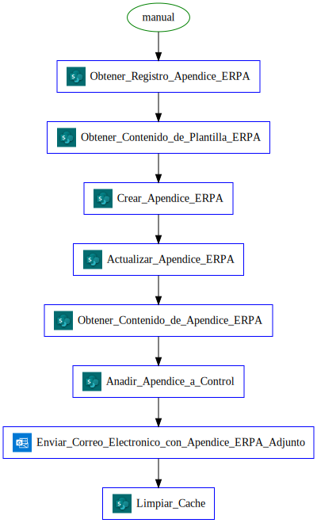

# Flow Documentation \- ApendiceERPA

| Flow Name                  | ApendiceERPA                             |
| -------------------------- | ---------------------------------------- |
| Flow Name                  | ApendiceERPA                             |
| Flow ID                    | 460e14ee\-f0ad\-45f1\-af6a\-4e7c7522f1dc |
| Documentation generated at | domingo, 30 de abril de 2023 02:46 p. m. |
| Number of Variables        | 0                                        |
| Number of Actions          | 8                                        |

- [Overview](index-ApendiceERPA(460e14ee-f0ad-45f1-af6a-4e7c7522f1dc).md)
- [Connection References](connections-ApendiceERPA(460e14ee-f0ad-45f1-af6a-4e7c7522f1dc).md)
- [Variables](variables-ApendiceERPA(460e14ee-f0ad-45f1-af6a-4e7c7522f1dc).md)
- [Triggers & Actions](triggersactions-ApendiceERPA(460e14ee-f0ad-45f1-af6a-4e7c7522f1dc).md)

## Flow Overview

The following chart shows the top level layout of the Flow. For a detailed view, please visit the section called Detailed Flow Diagram

## Detailed Flow Diagram

The following chart shows the detailed layout of the Flow

